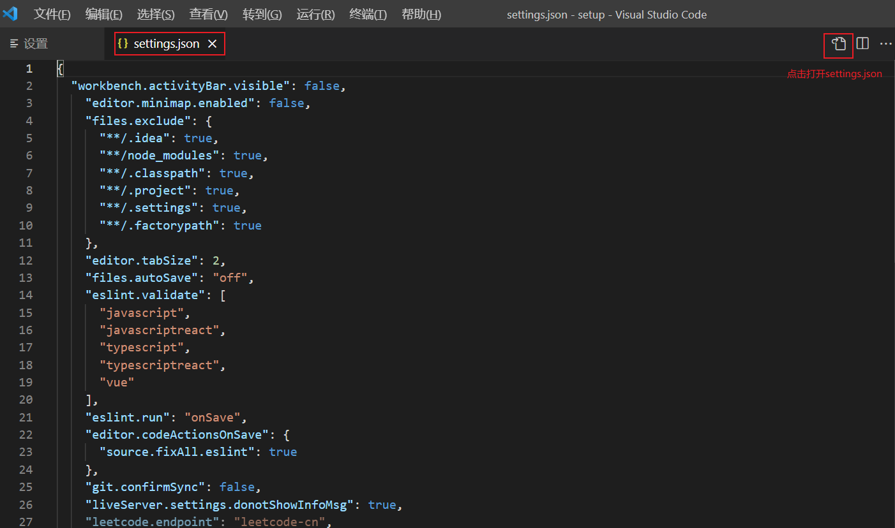
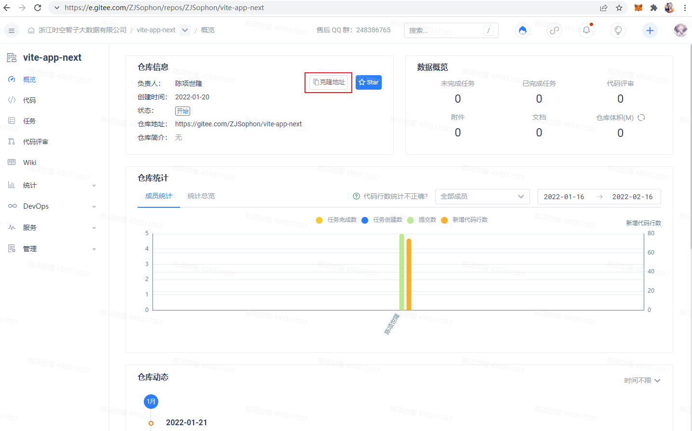
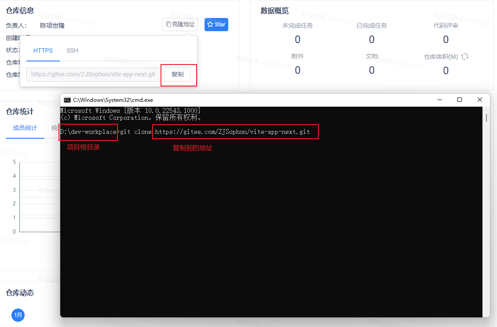
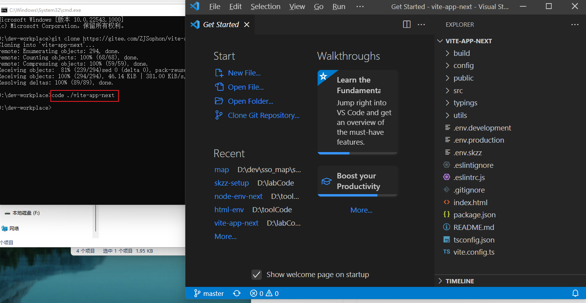
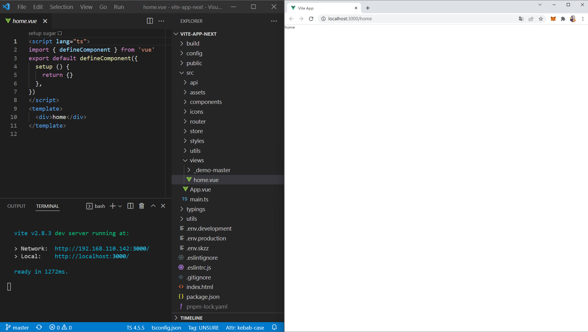

<route>
{
  meta: {
    title: "开发环境",
    sorted: 0
  }
}
</route>

# 开发环境

## 软件安装

+ 代码管理工具`git`： https://git-scm.com/
+ 推荐代码编辑器`vscode`：https://code.visualstudio.com/
+ JavaScript 运行时环境`nodejs`：https://nodejs.org/zh-cn/
+ web浏览器推荐`chrome`：https://www.google.com/intl/zh-CN/chrome/

## vscode

### 必需插件

去`vscode`插件市场下载。

#### ESLint

用于代码风格校验，自动格式化。

在 File（文件） > Preferences（首选项） > Settings（设置）, 通过右上角入口，打开`settings.json`



**添加**如下键值，设置保存时自动使用`ESLint`格式化

```json
{
    "files.autoSave": "off",
    "eslint.validate": [
        "javascript",
        "javascriptreact",
        "typescript",
        "typescriptreact",
        "vue"
    ],
    "eslint.run": "onSave",
    "editor.codeActionsOnSave": {
     "source.fixAll.eslint": true
    }
}
```

#### Vue Language Features (Volar)

添加Vue3语言支持


## 前端技术栈

+ [Vue3](https://vuejs.org/)

  > web开发主要框架，务必通读官网文档。

+ [ElementPlus](https://element-plus.gitee.io/zh-CN/)

  > ui组件库，提供前端常用控件，节省开发时间。
  >
  > 不要过度依赖 ui 组件。

+ [ArcGIS API for JavaScript](https://developers.arcgis.com/javascript/latest/)

  > GIS开发库，从 [get-started](https://developers.arcgis.com/javascript/latest/get-started/) 开始了解webGIS基础概念并尝试开发

+ [TypeScript](https://www.typescriptlang.org/)

  > 为JavaScript添加类型系统。可以使项目更加健壮，可维护性更强。

## 启动一个web项目

### 使用gitee平台

我司项目管理在 [gitee](https://gitee.com/) 平台上。如果没有账号，先[注册](https://gitee.com/signup)。

通过[企业代码仓库](https://e.gitee.com/ZJSophon/code/repos) ，查看已有项目。

> 如果没有权限，联系管理员，告知你的gitee账号，请求添加权限。

### 拉取一个项目代码

以 [vite-app](https://e.gitee.com/ZJSophon/repos/ZJSophon/vite-app-next) （一个模板项目）为例。

1. 访问：https://e.gitee.com/ZJSophon/repos/ZJSophon/vite-app-next




2. 克隆项目

```shell
>/d/dev-workplace>  git clone https://gitee.com/ZJSophon/vite-app-next.git
```




3. 在项目路径下启动vscode

```shell
>/d/dev-workplace> code ./vite-app-next
```



4. 安装依赖，启动项目

```shell
>/d/dev-workplace/vite-app-next> npm i
>/d/dev-workplace/vite-app-next> npm run dev
```



## NEXT

+ <router-link to="/docs/setup/menu">了解目录结构</router-link>

<!-- + <router-link to="/docs/setup/git-command">了解常用git命令</router-link> -->
